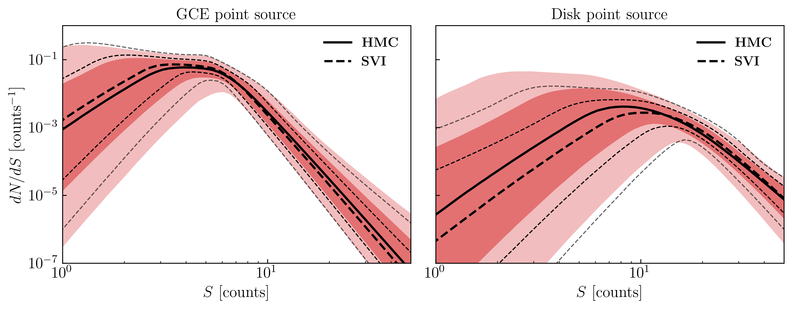

# Differentiable Probabilistic Programming for *Fermi* and the Galactic Center Excess
<!-- <h1>Differentiable Probabilistic Programming<br>for <em>Fermi</em> and the Galactic Center Excess</h1> -->

A differentiable inference framework for *Fermi* gamma-ray data of the Galactic Center based on the NPTF likelihood.
Built with [JAX](https://github.com/jax-ml/jax) and [NumPyro](https://num.pyro.ai)
for high dimensional inference for the Galactic Center Excess (GCE). Capable of dealing with flexible templates for both diffuse and point source components.

<p align="center">
  
  <br>
  <em>Posterior convergence via Stochastic Variational Inference (SVI).</em>
</p>

---

## Quick Start

Fitting the fiducial model to *Fermi* data:

```python
from fpp.models.np_model import NPModel

m = NPModel()  # loads Fermi data, templates, PSF, masks, etc.

# SVI with an inverse autoregressive flow (IAF)
m.fit_svi(data=m.fermi_data, guide='iaf', num_flows=5, hidden_dims=[128, 128],
           lr=3e-4, n_steps=10000)

# or, HMC via NUTS
m.run_nuts(data=m.fermi_data, num_chains=4, num_warmup=500, num_samples=2500)
```

### Extending the Model

`NPModel` can be customized. E.g. for adding an isotropic point source population on top of the fiducial model. Just inherit and override `model()` --- everything else (templates, PSF corrections, exposure regions) can be reused:

```python
import jax.numpy as jnp
import numpyro
import numpyro.distributions as dist
from fpp.models.np_model import NPModel
from fpp.models.scd import dnds
from fpp.utils.utils import jnp_trapezoid

class NPModelIso(NPModel):
    """Fiducial model + isotropic point sources."""

    def model(self, data=None, beta=1.):

        # ... [fiducial model components go here] ...
        # Here we show the *new* piece: an isotropic PS population

        Sps_iso = numpyro.sample("Sps_iso", dist.Uniform(1e-5, 8.)) # Normalization in counts
        temp_ps_iso = self.temp_iso # Resuing pre-loaded isotropic spatial template (same as exposure)

        n1  = numpyro.sample("n1_iso",  dist.Uniform(4.0, 6.0)) # Two break power law SCD
        n2  = numpyro.sample("n2_iso",  dist.Uniform(0.5, 1.99))
        n3  = numpyro.sample("n3_iso",  dist.Uniform(-6., -5.))
        sb1 = numpyro.sample("sb1_iso", dist.Uniform(5., 40.))
        lam = numpyro.sample("lam_iso", dist.Uniform(0.1, 0.95))

        s_arr = jnp.logspace(-1., 2., 1000)
        theta = jnp.array([1., n1, n2, n3, sb1, lam * sb1])
        A = Sps_iso / jnp_trapezoid(s_arr * dnds(s_arr, theta), s_arr)

        # ... append [A, n1, n2, n3, sb1, lam*sb1] into the likelihood
        #     alongside self.temp_iso as the spatial template
        #     see examples/2_fit_to_fermi_data.ipynb ...

m_iso = NPModelIso()
m_iso.fit_svi(data=m_iso.fermi_data, guide='iaf', num_flows=5,
              hidden_dims=[128, 128], lr=3e-4, n_steps=5000)
```

The full working example lives in [`examples/2_fit_to_fermi_data.ipynb`](examples/2_fit_to_fermi_data.ipynb).

---

## Installation

Create a fresh environment via `mamba` or `conda`:

```bash
mamba create -n fpp python=3.12
mamba activate fpp
```

Install JAX for your hardware --- see the [JAX installation guide](https://jax.readthedocs.io/en/latest/installation.html) for GPU/TPU instructions:

```bash
# CUDA 12 (example)
pip install jax[cuda12]
```

Then install `fpp` and dependencies in the repo directory:

```bash
pip install -e .
```

---

## Results
Fiducial inference on Fermi data (573 weeks, 2~20 GeV, `ultracleanveto`, top PSF quartile).

<p align="center">
  
  <br>
  <em>Posterior for select parameters.</em>
</p>

<p align="center">
  
  <br>
  <em>Posterior for source count functions.</em>
</p>

---

## Citation

If you use this code, please cite:

```bibtex
@article{fpp2026,
  title   = {Disentangling gamma-ray observations of the Galactic Center
             using differentiable probabilistic programming},
  author  = {Mishra-Sharma, Siddharth and Slatyer, Tracy R. and Sun, Yitian and Wu, Yuqing},
  year    = {2026},
  journal = {TODO}
}
```

---

## Authors

Siddharth Mishra-Sharma, Tracy R. Slatyer, [Yitian Sun](mailto:yitian.sun@mcgill.ca), and Yuqing Wu
